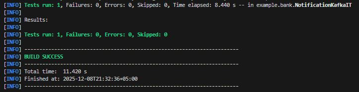
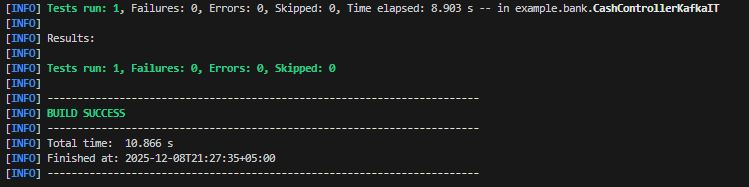
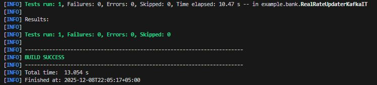
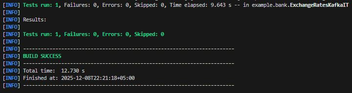
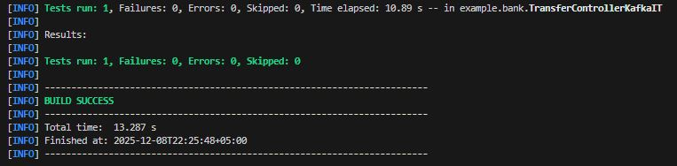

## Работа с замечаниями Спринт 10:

* Убраны бинарные архивы Helm из репозитория.

* В Деплоймент добавлены корректные настройки resources: requests/limits, livenessProbe и readinessProbe.

* Исправлен Jenkins-пайплайн: тест → dev → test → prod: сделан правильный многоэтапный CI/CD с разделением namespace:

bank-dev

bank-test

bank-prod

* Исправлены Helm-тесты.

* Для prod добавлен единый Ingress Gateway. Приложение доступно по адресу: http://localhost/bank.

* К сожалению, не удалось корректно реализовать авторизацию пользователя и аутентификацию (получение токенов для микросервисов) Кейклок в K8s одновременно.

Keycloak внутри контейнера работает на внутреннем hostname (hostname внутри pod'а), а внешние сервисы (браузер) обращаются к нему через внешний URL (Ingress/NodePort), из-за чего происходит несоответствие redirect_uri и issuer.

OIDC Discovery (/.well-known/openid-configuration) отдает внутренние URL, типа: http://keycloak:8080/realms/bank, а браузер- по внешним URL, например: http://auth.localhost/realms/bank

Keycloak запрещает авторизацию и выдает ошибки вида: Invalid redirect_uri, Issuer mismatch, Token validation failed.

- В настоящий момент найден один из путей реализации данной конфигурации приложения: использование частично динамических URL.

При этом: запускаем Keycloak с явным --hostname (наружный URL):

    kc.sh start \
    --hostname http://auth.localhost \
    --proxy-headers xforwarded \
    --http-enabled true \
    --hostname-strict=true

тогда:

OIDC discovery (/.well-known/openid-configuration) всегда отдаёт issuer = http://auth.localhost/realms/bank,

все эндпоинты (auth, token, jwks) будут тоже на http://auth.localhost/....

В связи с ограничением по времени, это решение пока не применено в проекте.

## Спринт 11 - Последовательность работы над приложением

* внедрена платформа Apache Kafka для взаимодействия микросервисов;

* платформа Apache Kafka разворачивается в Kubernetes с использованием Helm-чартов;

* взаимодействия с сервисом Notifications не используют REST, обмен сообщениями осуществляется через соответствующий топик Apache Kafka;

* взаимодействие между сервисами Exchange и Exchange Generator не использует REST, обмен сообщениями осуществляется через соответствующий топик Apache Kafka;

* написан Jenkinsfile для развёртывания/обновления платформы Apache Kafka, её конфигурации, топиков и т. д.;

* доработан Jenkinsfile для всего зонтичного проекта: в него добавлена возможность развёртывания/обновления платформы Apache Kafka, её конфигурации, топиков и т. д.;

* Jenkinsfile применены в CI/CD Jenkins и хранятся в Git.

## Пояснения в работе приложения

Из сервиса exchange-generator убрана зависимость spring-boot-starter-webflux и добавлена зависимость spring-webflux, т.к. в сервисе есть есть компонент: WebClient webClient, а также вызов внешнего API: 
webClient.get().uri(...).retrieve().

WebClient находится именно в spring-webflux, без этой зависимости: WebClient не будет создан.

В notification-service оставлен spring-boot-starter-webflux, т.к. сервис имеет REST endpoint и отдает уведомления в UI (Alert в Gateway). Поэтому WebFlux нужен как HTTP сервер.

Если бы notification-service был только Kafka consumer, тогда: WebFlux Starter можно было удалить и оставить только spring-webflux (для JSON и reactive libs).

В exchange-service также оставлен spring-boot-starter-webflux, т.к. сервис имеет REST endpoint и взаимодействует с accaunt-service.

## Запуск приложения в работу локально:

* запустить minikube: minikube start

* пробросить порт 80 сервиса ingress-nginx-controller на локальную машину порт 80:
    
    kubectl port-forward svc/ingress-nginx-controller 80:80 -n ingress-nginx

* обновить зависимости: helm dependency update helm-charts/bank-platform

* запустить Helm: helm upgrade --install bank-platform helm-charts/bank-platform -f helm-charts/bank-platform/values.yaml

## Запуск CI/CD Pipeline (Build → Test → Docker → Push → Deploy):

    запустить и открыть Blue Ocean: http://jenkins:8080/blue

    выбрать job -> нажать Run.

* В результате в Blue Ocean прямо видно pipeline:

зелёные шаги — success

синие — running

красные — fail

    Blue Ocean:

    - отображает pipeline

    - визуализирует шаги

    - показывает логи

    - даёт кнопку "Run"

    - показывает, какие стадии прошли

## Результаты тестирования:

notification-service:

cash-service:

exchange-generator:

exchange-service:

transfer-service:

