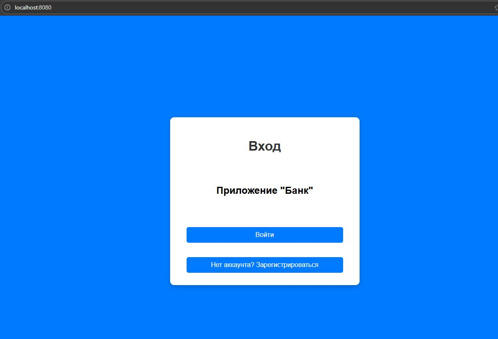
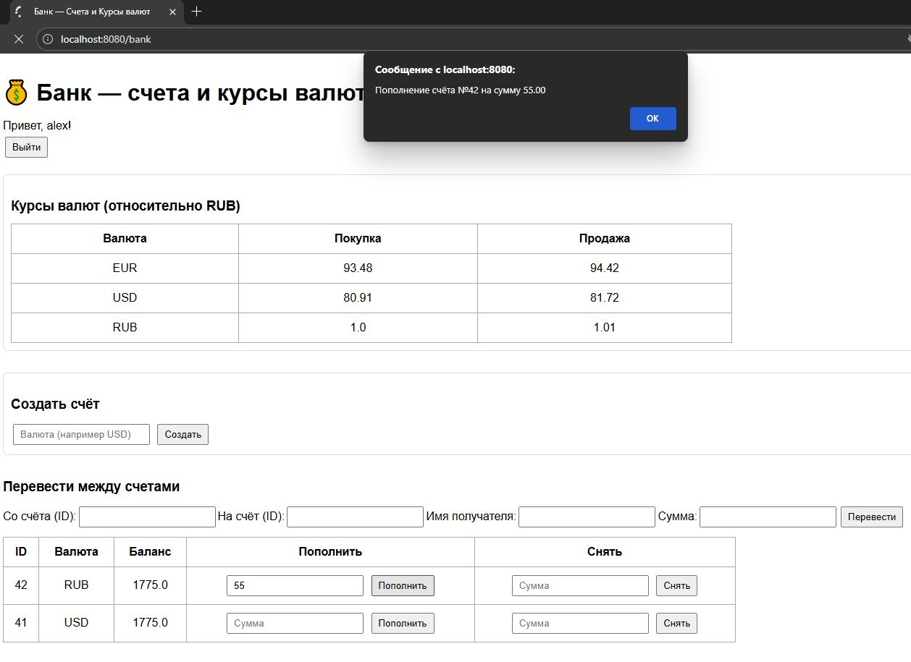
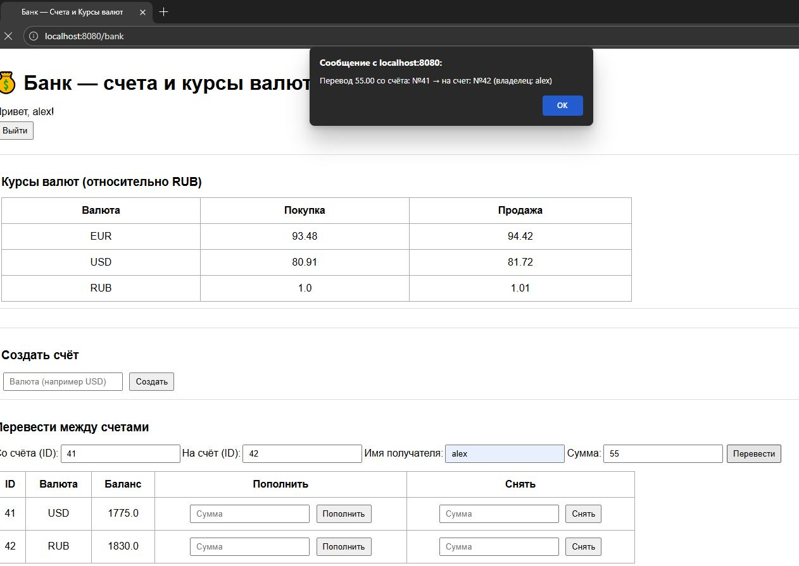
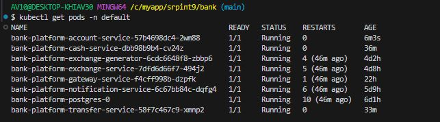
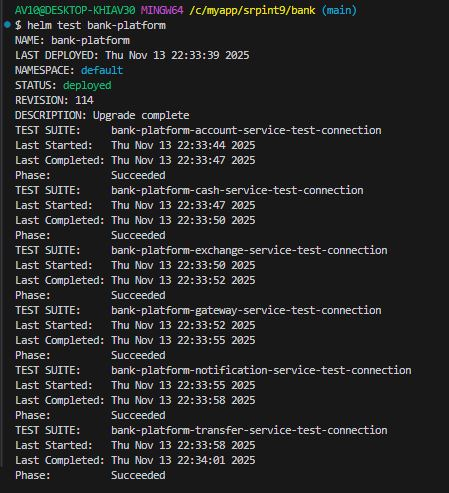

# Микросервисное приложение «Банк» — это приложение с веб-интерфейсом, которое позволяет пользователю (клиенту банка):

    регистрироваться и авторизовываться в приложении по логину и паролю (при регистрации в приложении автоматически создается пользователь с логином и паролем на сервере авторизации KeyKloak, авторизация происходит с перенаправлением на сервер авторизации KeyKloak);

    класть виртуальные деньги на счёт своего аккаунта и снимать их;

    переводить виртуальные деньги на счёт другого аккаунта.

    
## Приложение состоит из следующих микросервисов:
    фронт (gateway-service);
    сервиса аккаунтов (accounts-service);
    сервиса обналичивания денег (cash-service);
    сервиса перевода денег на счёт другого аккаунта (transfer-service);
    cервиса конвертации валют (exchange-service);
    сервиса генерации курсов валют (exchange-generator);
    сервиса уведомлений (notifications-service).

## Функциональность

* Развёртывание микросервисов осуществляется локально в Kubernetes (в качестве реализации используеться Minikube).
* В качестве пакетного менеджера и шаблонизатора для развёртывания микросервисов используется Helm.
* Базы данных развёрнуты в Kubernetes с использованием StatefulSets.
Микросервисы развёрнуты в Kubernetes с использованием Deployments (количество реплик - по одной на микросервис).
* Для реализации Service Discovery в Kubernetes созданы Service для каждого микросервиса (разрешение имён на уровне DNS).
* Для реализации Gateway API в Kubernetes используется Gateway API (микросервисы выполняют запросы в другие микросервисы через этот Gateway API).
* В качестве Externalized/Distributed Config в Kubernetes созданы ConfigMaps и Secrets.
* Helm-чарты для микросервисов оформлены в виде сабчартов, объединённых под один общий зонтичный Helm-чарт, и хранятся в Git (можно развёртывать как каждый микросервис отдельно с использованием его сабчарта, так и все микросервисы сразу с использованием зонтичного чарта).
* OAuth 2.0 сервер авторизации развёрнут в Kubernetes с использованием Helm.
Предусмотрено развёртывание микросервисов в различных средах (разработка, тестинг, продакшен) с использованием пространств имён (namespaces) в Kubernetes (например, dev, test, prod).
* Для тестирования Helm-чартов реализованы тесты с использованием возможностей тестирования Helm-чартов.
* В качестве системы непрерывной интеграции и доставки микросервисов используется CI/CD Jenkins.
* Для каждого микросервиса и всего зонтичного проекта реализованы пайплайны для валидации, сборки, тестирования, развёртывания в тестовой и продакшен-средах Kubernetes с использованием Helm-чартов (Jenkinsfile).
* Jenkinsfile хранятся в Git, есть возможность их применения в CI/CD Jenkins.

## Псоледовательность работы над приложением

1. Подготовка окружения

Установить Docker (для контейнеризации сервисов).

Установить kubectl (для управления кластерами Kubernetes).

Установить Minikube (локальный Kubernetes-кластер).

Установить Helm (для управления чартарами микросервисов).

2. Контейнеризация сервисов

Создать Dockerfile для каждого микросервиса.

Собрать и протестировать образы локально (docker build, docker run).

3. Helm-чарты

Создать Helm-чарт для каждого сервиса: deployment.yaml, service.yaml, configmap.yaml, secret.yaml.

Настроить values.yaml для параметров (replicas, порты, переменные окружения, секреты).

4. Секреты и конфиги

Создать Secrets для логинов/паролей к БД и OAuth.

Создать ConfigMap для настроек приложений.

Настроить envFrom и env в Deployment, чтобы сервисы использовали Secrets и ConfigMap.

5. Развёртывание локально

Запустить Helm для всех микросервисов:

helm upgrade --install <release-name> ./helm-charts -f values.yaml

Проверить статус Pod’ов:

kubectl get pods
kubectl logs <pod-name>

6. Тестирование

Создать Helm-тесты (templates/tests/test-connection.yaml) для проверки доступности сервисов.

Запустить тесты:

helm test helm test bank-platform --logs

## Запуск приложения в работу

Для корректной работы приложения необходимо:

- Запустить локально на Виндовс: сервер авторизации OAuth 2.0 Keycloak на порту 8090.

        В приложении используется URL, который подключается напрямую к локальному серверу Keycloak: http://192.168.0.140:8090/realms/bank.

        192.168.0.140 — это IP машины в локальной сети, с которой запускается Minikube.

        8090 — это порт, на котором поднят Keycloak. 

        /realms/bank — это путь к Realm в Keycloak. 

        Узнать IP хоста:

        Открыть PowerShell и выполнить: ipconfig

        Найти IPv4-адрес адаптера, который используется для подключения к локальной сети. Это будет аналог 192.168.0.140. Если адрес отличается, его необходимо изменить в настройках приложения.

- В Keycloak должен быть создан Realm - bank и созданы клиенты: account-service, gateway-service, cash-service, exchange-service, transfer-service, notifications-service, присвоены роли: openid, profile, email и получены client-secret, котрые нужно будет прописать в application.yml каждого сервиса.

- В контейнере с PostgreSQL создать БД bank c двумя схемамми:

1. account - таблица account с соответствующими модели полями;

2. users - таблица user с соответствующими модели полями.

- Создать Secret для Keycloak client-secret следующими командами:

        kubectl create secret generic account-service-keycloak-secret \
        --from-literal=client-secret=your_client-secret \
        -n default

        kubectl create secret generic cash-service-keycloak-secret \
        --from-literal=client-secret=your_client-secret \
        -n default

        kubectl create secret generic gateway-service-keycloak-secret \
        --from-literal=client-secret=your_client-secret \
        -n default

        kubectl create secret generic transfer-service-keycloak-secret \
        --from-literal=client-secret=your_client-secret \
        -n default

- Создать Secret для Postgres следующими командами:

        kubectl create secret generic account-service-db-credentials \
        --from-literal=username=your_username \
        --from-literal=password=your_secret_pass \
        -n default

        kubectl create secret generic gateway-service-db-credentials \
        --from-literal=username=your_username \
        --from-literal=password=your_secret_pass \
        -n default

- Для развёртывание микросервисов локально в Kubernetes:

запустить Minikube:

        minikube start

        Проверить статус:

        minikube status

Обновить зависимости:

        helm dependency update helm-charts/bank-platform

Запустить Helm для всех микросервисов:

        helm upgrade --install bank-platform helm-charts/bank-platform -f helm-charts/bank-platform/values.yaml

Проверить PVC и Pods

        kubectl get pvc -n default

        kubectl get pods -n default

## Тестирование

Для тестирования Helm-чартов реализованы тесты с использованием возможностей тестирования Helm-чартов.

## Скрины работы приложения:

Вход в приложение:

Пополнение счета пользователя:

Перевод со счета на счет по номеру счета и имени:

Поды Status:

Тесты:

