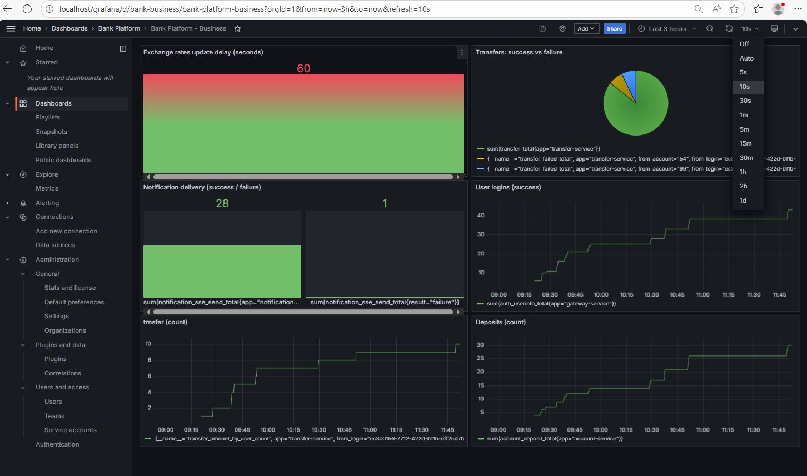
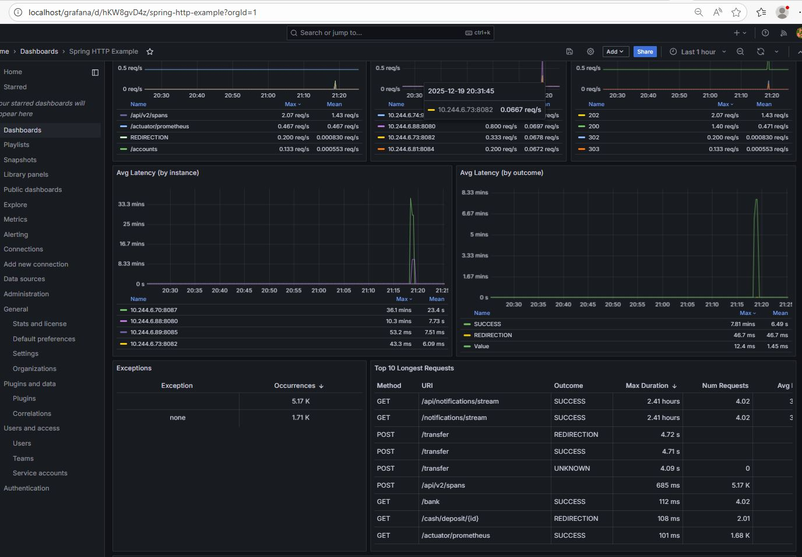
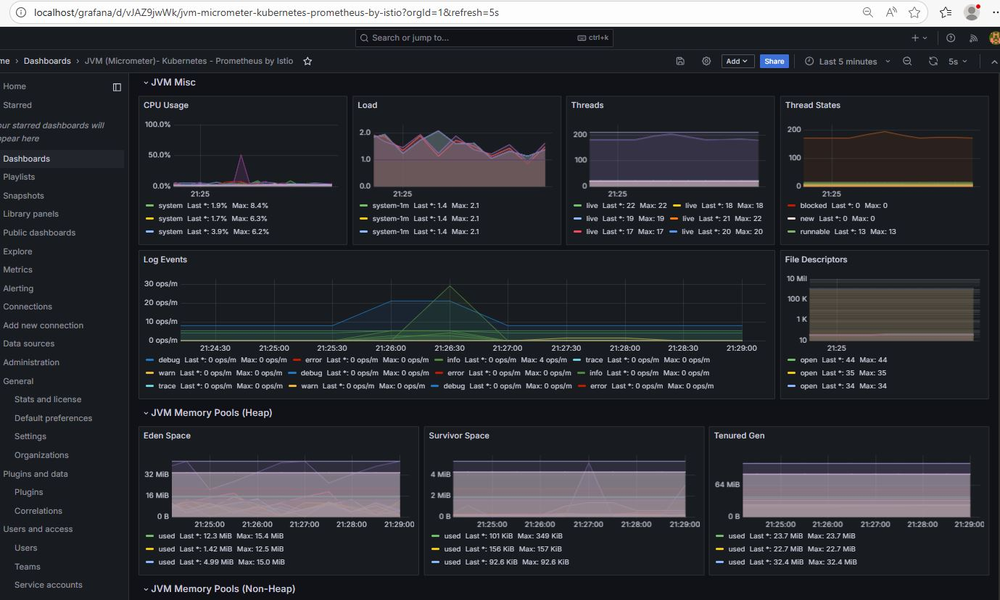
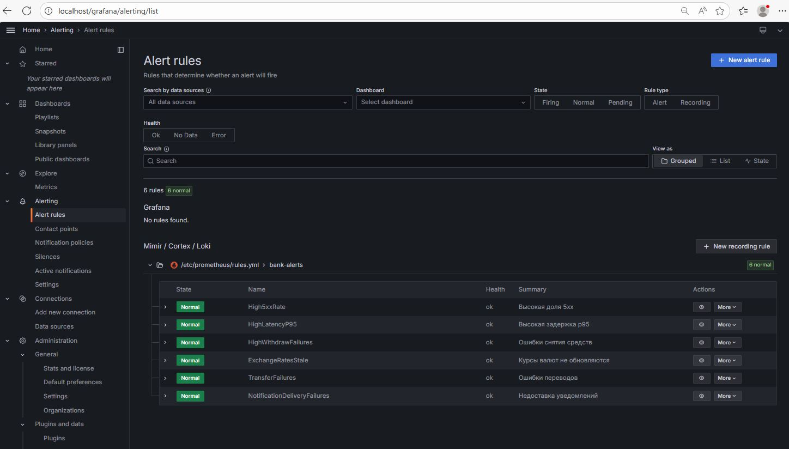
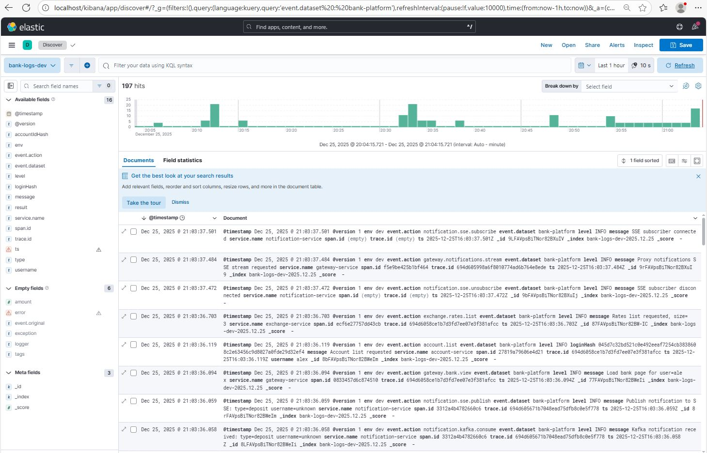
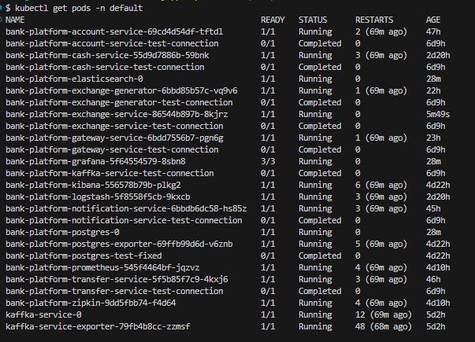

## Работа с замечаниями Спринт 12:

1. Архитектура логирования

В микросервисах: account-service, cash-service - исправлена архитектура логирования, применен Log4j2 - Kafka appender и chassis-паттерн.

Логирование отделено от бизнес-логики, бизнес-код не связан с инфраструктурой доставки логов.

2. Нейминг метрик

Были использованы общие имена с метками (labels) - пример для cash-service:

business_operation_total с метками type="deposit", service="cash", status="success".

    private void incBusiness(String type, String status) {
                    Counter.builder("business_operation_total")
                                    .tag("service", "cash")
                                    .tag("type", type) // deposit/withdraw/notify
                                    .tag("status", status) // success/failure
                                    .register(meterRegistry)
                                    .increment();
            }

Пример для account-service: account-service\src\main\resources\log4j2-spring.xml:

      <!-- Единый JSON-контракт ("шасси") -->
      <PatternLayout pattern="{&quot;ts&quot;:&quot;%d{yyyy-MM-dd'T'HH:mm:ss.SSSX}&quot;,
        &quot;level&quot;:&quot;%p&quot;,
        &quot;service&quot;:&quot;${APP_NAME}&quot;,
        &quot;env&quot;:&quot;${ENV}&quot;,
        &quot;event&quot;:{&quot;action&quot;:&quot;%X{event.action}&quot;},
        &quot;operation&quot;:{&quot;type&quot;:&quot;%X{operation.type}&quot;,&quot;status&quot;:&quot;%X{operation.status}&quot;},
        &quot;message&quot;:&quot;%enc{%m}{JSON}&quot;,
        &quot;trace.id&quot;:&quot;%X{traceId}&quot;,
        &quot;span.id&quot;:&quot;%X{spanId}&quot;}
        %n"/>

В результате лог сервисов стал более понятным и информативным, что упрощает создание графиков в Grafana.

Пример вывода лога в UI Kibana account-service (неполная часть):

    {
    "@timestamp": [
        "2025-12-27T11:25:26.907Z"
    ],
    "event.action": [
        "account.deposit"
    ],
    "event.action.keyword": [
        "account.deposit"
    ],
    "message": [
        "Deposit success login=9e42428d-ed5b-44a1-bcad-6804bf3ac1b8 accountId=47 amount=\"\""
    ],
    "message.keyword": [
        "Deposit success login=9e42428d-ed5b-44a1-bcad-6804bf3ac1b8 accountId=47 amount=\"\""
    ],
    "operation.status": [
        "success"
    ],
    "operation.status.keyword": [
        "success"
    ],
    "operation.type": [
        "deposit"
    ],
    "operation.type.keyword": [
        "deposit"
    ],
    "service.name": [
        "account-service"
    ],
    "service.name.keyword": [
        "account-service"
    ],
    "span.id": [
        "ac210c3bf79de730"
    ],
    "span.id.keyword": [
        "ac210c3bf79de730"
    ],
    "trace.id": [
        "694fc226fd6b7eee844131910b99baf4"
    ],
    "trace.id.keyword": [
        "694fc226fd6b7eee844131910b99baf4"
    ],
    "ts": [
        "2025-12-27T11:25:26.907Z"
    ],
    "_id": "UBGOX5sBSFBmHvE_aMPe",
    "_index": "bank-logs-dev-2025.12.27",
    "_score": null
    }

## Работа с замечаниями и предложениями Спринт 11:

1. Тест CashControllerKafkaIT исправлено:

@SpringBootTest(classes = CashServiceApplication.class, ...) - поднимается нормальный Boot-контекст, со всеми автоконфигами, включая KafkaTemplate.

Не ограничиваемся classes = CashController.class:

    KafkaTemplate<String, Notification> создаётся автоконфигом spring-kafka,
    CashController получает реальный KafkaTemplate и мокнутый WebClient.

Через @TestPropertySource:

    задаём топик app.kafka.topics.notifications,

    подключаем spring.kafka.bootstrap-servers к EmbeddedKafka,

    отключаем реактивную security-автоконфигурацию.

Вызываем именно публичный метод deposit(...), (“не тестировать приватные методы”):

    вход: параметры accountId и amount,

    результат: запись в Kafka-топике notifications.raw.

2. Тест TransferControllerKafkaIT, исправлено:

Исключена рефлексия — не трогаем приватный метод sendNotification(...).

Тест привязан к публичному API контроллера transfer(@RequestBody TransferRequest request).

Kafka-интеграция проверяется end-to-end через EmbeddedKafka.

TransferService замокан — тест не зависит от бизнес-логики перевода и внешних HTTP-вызовов.

Security в тестовом контексте отключена через spring.autoconfigure.exclude и не мешает поднятию контекста.

3. Замечание: "сохраняешь сущность в БД (который repository.save), а в doOnSuccess отправляешь сообщение в Kafka. Если сообщение в Kafka не уйдет (сбой сети, брокер недоступен), у тебя в базе будет созданный аккаунт, но уведомление не отправится, и другие сервисы об этом не узнают".

Исправление (на примере account-service):

Для гарантии доставки события в сервисе account-service при создании нового счета пользователя применен паттерн Transactional Outbox.

После исправления, вместо того чтобы сразу слать сообщение в Kafka:

в одной БД-транзакции: сохраняем новый счет в Account и сохраняем Outbox-событие (которое нужно отправить в Kafka).

Отдельный компонент читает таблицу outbox и отправляет события в Kafka, помечая их как обработанные.

Т.е.: БД-коммит = и аккаунт, и запись в outbox.

Если транзакция не закоммитилась — нет ни аккаунта, ни события.

Изменения:

* добавлена Outbox-сущность;

* В БД bank создана схема/таблица outbox.outbox_events;

* добавлен OutboxProcessor;

* доработан AccountController.

# Функциональность

1. Каждый микросервис реализует поставку своих трейсов в Zipkin:

берёт trace id и parent span id из соответствующих HTTP-заголовков входящего запроса (за исключением Front UI, который должен генерировать trace id);

генерирует span id и осуществляет отправку трейсов в Zipkin;

передаёт в HTTP-заголовках trace id и свой сгенерированный span id как родительский во всех исходящих HTTP-запросах;

генерирует дочерний span id при осуществлении запросов в БД и Apache Kafka, осуществляет отправку в Zipkin трейсов запросов в БД и Apache Kafka.

2. Каждый микросервис реализует поставку метрик в Prometheus:

HTTP-запросов (RPS, 4xx, 5xx, персентили таймингов), дефолтные метрики Spring Boot-приложений, метрики JVM и т. д.;

настроены алерты по превышению пороговых значений метрик (в Prometheus или Grafana).

3. Каждый микросервис реализует логирование информационной, диагностической информации и ошибок в топик Apache Kafka для логов:

создан общий топик в Apache Kafka, куда отправляются логи микросервисов;
логи отправляются с использованием фасада Slf4j и бэкенда Log4j2/Logback в общем для всех логов формате;

в логах присутствует информация о соответствующем trace id и span id для связывания логов с трейсами, в рамках которых осуществлялся запрос.

4. Администратор приложения может:

посмотреть трейсы микросервисов в Zipkin;

посмотреть графики метрик на дашбордах в Grafana;

посмотреть логи микросервисов в Kibana;

получить алерты по превышению пороговых значений метрик в Prometheus или Grafana.

# Комментарии по реализации: "логирование информационной, диагностической информации и ошибок в топик Apache Kafka для логов:

В связи с проблемами на первоначальном этапе подключения и настройки "Kafka Appender" в сервисах: account-service, cash-service логирование было выполнено следующим образом:

    •	применен кастомный логгер KafkaJsonLogger

    •	логи вручную формируются в коде (ObjectMapper → JSON)

    •	отправка логов в Kafka через отдельный KafkaTemplate<String, String>

    •	Трейсинг:

        traceparent (W3C) парсится WebFilter

        trace.id / span.id вручную добавляются в JSON

    •	формат логов (Microservice Chassis) задается кодом, а не логгером

После настройки и применения "Kafka Appender" в сервисах: transfer-service, notification-service, exchange-generator, exchange-service, gateway-service:

•	используется стандартный фасад Slf4j

•	испоьзуется Log4j2 + Kafka Appender

•	единый JSON-формат задаётся в файле log4j2-spring.xml

•	логи пишутся обычным log.info / warn / error

•	event.action передаётся через MDC

•	Трейсинг:

    Micrometer Tracing

    trace.id / span.id автоматически попадают в MDC

    Kafka / WebClient / HTTP дают spans в Zipkin

Архитектура: 

Slf4j → Log4j2 → KafkaAppender → Kafka (bank-platform-logs) → Logstash → Elasticsearch → Kibana

* В связи с ограничением по времени, не удалось реализовать корректную работу сервера авторизации OAuth 2.0 Keycloak в K8s (авторизацию пользователя и аутентификацию (получение токенов для микросервисов) Кейклок в K8s одновременно).

Что не получилось: 

Keycloak внутри контейнера работает на внутреннем hostname (hostname внутри pod'а), а внешние сервисы (браузер) обращаются к нему через внешний URL (Ingress/NodePort), из-за чего происходит несоответствие redirect_uri и issuer.

OIDC Discovery (/.well-known/openid-configuration) отдает внутренние URL, типа: http://keycloak:8080/realms/bank, а браузер- по внешним URL, например: http://auth.localhost/realms/bank

Keycloak запрещает авторизацию и выдает ошибки вида: Invalid redirect_uri, Issuer mismatch, Token validation failed.

- В настоящий момент найден один из путей реализации данной конфигурации сервера авторизации: использование частично динамических URL.

При этом: запускаем Keycloak с явным --hostname (наружный URL):

    kc.sh start \
    --hostname http://auth.localhost \
    --proxy-headers xforwarded \
    --http-enabled true \
    --hostname-strict=true

тогда:

OIDC discovery (/.well-known/openid-configuration) всегда отдаёт issuer = http://auth.localhost/realms/bank,

все эндпоинты (auth, token, jwks) будут тоже на http://auth.localhost/....

Настройка корректной работы сервера авторизации КейКлок в K8s пока не завершена, авторизация пользователей и получение токенов в приложении происходит на сервере авторизации OAuth 2.0 Keycloak, развернутом локально на порту 8090.

## Скрины работы приложения:

Zipkin Dependencies

Zipkin Transfer - 4 services 41 spans

Prometheus

Grafana DashBoard 1

Grafana DashBoard 2

Grafana DashBoard 3

Grafana allerting

Kibana Logs

Pods

Пример вывода лога Кибана

    {
    "@timestamp": [
        "2025-12-25T16:03:37.484Z"
    ],
    "@version": [
        "1"
    ],
    "@version.keyword": [
        "1"
    ],
    "env": [
        "dev"
    ],
    "env.keyword": [
        "dev"
    ],
    "event.action": [
        "gateway.notifications.stream"
    ],
    "event.action.keyword": [
        "gateway.notifications.stream"
    ],
    "event.dataset": [
        "bank-platform"
    ],
    "event.dataset.keyword": [
        "bank-platform"
    ],
    "level": [
        "INFO"
    ],
    "level.keyword": [
        "INFO"
    ],
    "message": [
        "Proxy notifications SSE stream requested"
    ],
    "message.keyword": [
        "Proxy notifications SSE stream requested"
    ],
    "service.name": [
        "gateway-service"
    ],
    "service.name.keyword": [
        "gateway-service"
    ],
    "span.id": [
        "f5e9be425b1bf464"
    ],
    "span.id.keyword": [
        "f5e9be425b1bf464"
    ],
    "trace.id": [
        "694d605998a6f8010774ad6b764e8ede"
    ],
    "trace.id.keyword": [
        "694d605998a6f8010774ad6b764e8ede"
    ],
    "ts": [
        "2025-12-25T16:03:37.484Z"
    ],
    "_id": "9rFAVpsBiTNor82BXuI9",
    "_index": "bank-logs-dev-2025.12.25",
    "_score": null
    }

